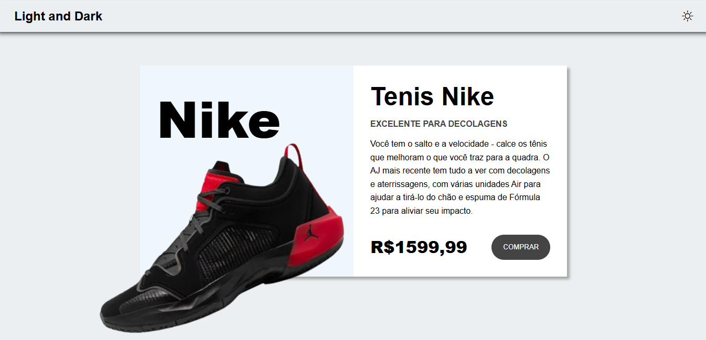
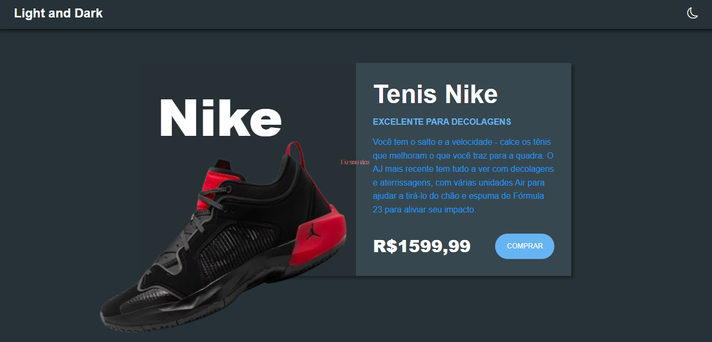

# PROJETO: Dark mode com JS
O banner da página principal de um tênis da Nike pode ser exibido nos temas dark e light mode ao clicar nos botões no canto superior direito da página.

Além disso, a página oferece a possibilidade de salvar o tema de preferência do usuário que será armazenado na "LocalStorage", assim sendo quando o usuário sair da página e abrir uma nova será possível o resgate das opções desse usuário.

# TECNOLOGIAS:
- HTML
- CSS
- JAVASCRIPT
- GIT/GITHUB